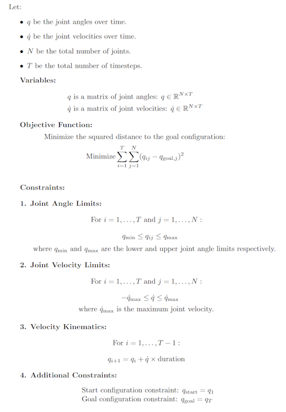
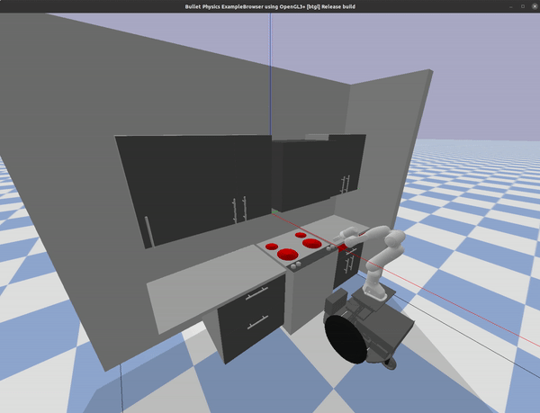

Final Project Repo for Aneesa &amp; Anjali  
MIT 16.413 - Fall 2023

# Tasks
- Writeup for trajopt
- Video of trajopt
- Locations for HAND_POSE3D in run_simulation
- How to move objects to gripper??? How to move out of gripper???
- How to open and close drawer?


# Deliverable 1: Activity Planning

This module implements an ActivityPlanner class that serves as a solver for activity planning problems utilizing the Planning Domain Definition Language (PDDL).

## Assumptions in Domain Design

During the design of the domain for activity planning, several assumptions were made to model the problem effectively. Assumptions include:
- There is only one drawer in the environment that we are able to manipulate.
- Each location (burner, countertop, inside of drawer) can only hold one item at a time.
- The robot arm can only hold one item at a time.
- We can abstract away the details of certain actions, e.g., how the gripper picks up different items.

## Files and Key Functions

### Files:
- `src/activity_planner.py`: Implements the `ActivityPlanner` class that serves as the core of the activity planning functionality.
- `pddl/pddl_domain.pddl` - Contains the PDDL domain definition including specification of the types, predicates, and actions
- `pddl/pddl_problem.pddl` - Contains the PDDL problem definition including specification of the objects, initial state, and goal state
- `padm-project-2023f/pddl-parser/pddl-parser/PDDL.py`: From the pddl-parser library. Contains the PDDL parsing functionalities used to read domain and problem files. Note: We have placed this folder in .gitignore, so the repo would need to be included in order for this code to run properly.

### Key Classes and Functions:

#### ActivityPlanner Class:
- `__init__(self, domain_file, problem_file)`: Initializes the ActivityPlanner object by parsing domain and problem files using the PDDL_Parser class from the pddl-parser library.
- `solve(self)`: Generates an activity plan based on the input domain and problem files.
- `_run_bfs_planner(self)`: Implements a breadth-first search planner to find a solution.
    - `generate_possible_actions(self, state)`: Generates possible actions based on the current state.
    - `apply_action(self, state, action)` - Applies an action to the state and generates a new state.
- `_extract_activity_plan(self, state, plan, path)`: Extracts the activity plan from the final state.

#### State Class:
- `__init__(self, state, parent, action, cost)`: Initializes the State object representing a state in the planning process.

## Approach Used for Plan Generation

The approach for plan generation involves:
- Parsing the PDDL domain and problem files using the `PDDL_Parser`.
- Initializing an `ActivityPlanner` object with the parsed information.
- Utilizing a breadth-first search planner (`_run_bfs_planner`) to find a solution by exploring possible actions and states.
- Extracting the resulting activity plan through the `_extract_activity_plan` function.

## Challenges Faced and Strategies Employed

During the development of the activity planning module, challenges included:
- Designing effective predicates, actions, and types to accurately model the domain.
    - We tried to utilize 'supertypes' in order to generalize our actions to handle different object types in the same way, but we ran into issues. After testing with multiple different pddl parsing libraries, we determined that none of them would efficiently be able to handle 'supertypes'. Thus, we had to switch back to the original library and rewrite our predicates and actions so as to be more explicit and allow for more straightforward parsing.
    - Replacement/Population of terms in order to quickly check which actions were feasible from a given state proved difficult. We came across many errors and ultimately decided to go with a more robust implementation that removed the need for parameters. This greatly improved our workflow.
- Ensuring correct parsing of PDDL files and handling errors in case of incorrect file formats or missing information.
- Implementing our initial planning approach using the FF heuristic proved to be quite complex, so we modified our approach to follow Breadth-First Search instead.


Strategies employed to address these challenges involved:
- Iterative refinement of predicates and actions based on domain understanding.
- Extensive testing and validation of the PDDL parsing functionalities.
- Experimenting with different planning algorithms and heuristics to optimize the solution process. The structure of the code allows for ease in switching between different planners if we were to implement other kinds as well.

## Example Result
Initial State:  {('clear_gripper',), ('countertop_has_spambox',), ('at_drawer',), ('burner_has_sugarbox',), ('clear_drawer',)}

Goal State:  {('countertop_has_sugarbox',), ('drawer_has_spambox',)} and not {('open_drawer',)}

Generated Plan: 
['open_drawer', 'movedtoc', 'pick_up_spamatc', 'movectod', 'put_down_spamatd', 'close_drawer', 'movedtob', 'pick_up_sugaratb', 'movebtoc', 'put_down_sugaratc']  


# Deliverable 2: Motion Planning
### Assumptions
- The robot doesn't need to decide where exactly to place the items once picked up; that is, the location of the countertop and the drawer are known.
- 

### Approach
We use RRT as the backbone of the motion planner.

- Outline steps of RRT algorithm
- Explain creation of goal "region" and tolerance used
- Explain collision-checking
- Explain arm dynamics (inverse kinematics)

### Key Functions
Connect to steps in approach above, or just name them in Approach section

### Challenges
- Difficult to parse what the simulator functions were actually doing vs. what their arguments suggested
    - Ex: `add_ycb` in the example takes a `counter` argument, but the `COUNTERS` defined in the given `utils.py` file don't have corresponding `Surface` objects, so any `counter` argument given leads to the same pose.
- Provided sampling function gives angles in configuration space (joint angles), not in 3D space so wrote a new sampling function (explain)

# Deliverable 3: Trajectory Optimization

This module provides a TrajectoryOptimizer class for optimizing joint trajectories.

## Files and Key Functions
The primary file is `trajectory_optimizer.py`, containing the `TrajectoryOptimizer` class. Key functions include:
- `__init__`: Initializes the optimizer with start and goal joint angles.
- `optimize_trajectory`: Performs joint trajectory optimization based on constraints and goals. Constraints are added to a Mathematical Program (via pydrake). The cost we are trying to minimize is the squared distance from the current joint angle configuration to the goal state joint angles.

## Solver Used
The code utilizes the `SnoptSolver` from PyDrake for solving the optimization problem.

## Optimization Problem
The optimization problem aims to find an optimal joint trajectory that navigates from a given start configuration to a specified goal configuration while respecting joint angle limits and velocity constraints.


### Formalization



## Challenges Faced
During the implementation, several challenges were encountered, such as:
- Balancing constraints and the objective function for effective convergence.
- Tuning the duration and the number of timesteps for optimal trajectory generation.
- Handling convergence failures and adjusting solver parameters.

## Example Plan
Here is an example of the robot executing the optimized trajectory for the action 'Move from Burner to Drawer'




## Result Comparison
The resulting optimized trajectory can be compared to the initial sample-based motion plan by evaluating the difference in joint angles and assessing the smoothness and efficiency of motion.

<!-- ### Code Comparison
```python
# Include code for comparing the initial sample-based motion plan with the optimized trajectory
# ...

# Example:
initial_motion_plan = # initial motion plan data
optimized_trajectory = output  # Obtained from TrajectoryOptimizer -->

